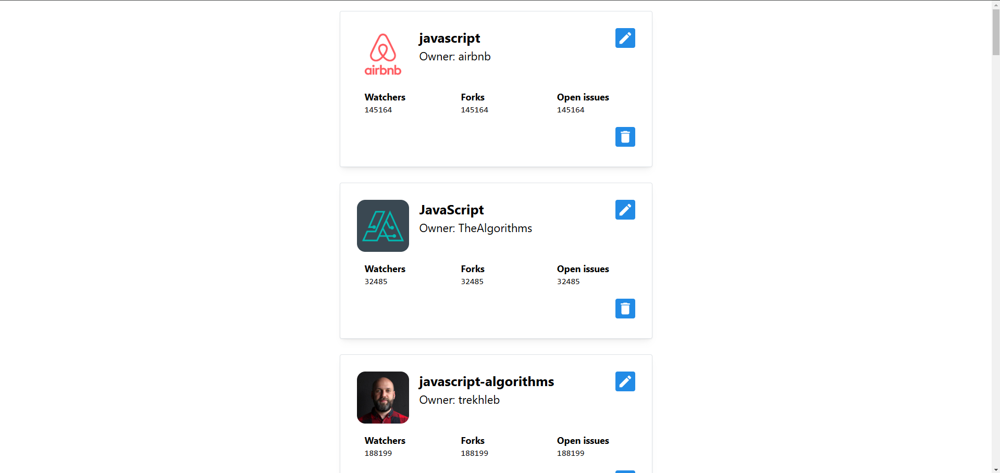

# React Task

## Оглавление

- [Инструкции по развертыванию](#инструкции-по-развертыванию)
- [Обзор](#обзор)
  - [Скриншот](#скриншот)
  - [Ссылки](#ссылки)
- [Мой процесс](#мой-процесс)
  - [Стек](#стек)
- [Автор](#автор)

## Инструкции по развертыванию

**Для запуска проекта на вашем компьютере должны быть установлены [npm](https://nodejs.org/en/) и [git](https://git-scm.com/downloads)**

> Версия Node: 20.18.0

1. Сделайте клон этого репозитория ```git clone https://github.com/klekwedge/react-task.git```
2. Установите все необходимые пакеты npm с помощью ```npm i```
3. Запустите проект командой ```npm run dev```

## Обзор

### Скриншот



### Ссылки

- [Ссылка на проект](https://github.com/klekwedge/react-task)
- [Деплой](https://klekwedge-react-task.vercel.app/)

## Мой процесс

### Обоснование почему выбрал Mantine

Я выбрал библиотеку Mantine, так как она обладает продуманным дизайном компонентов, так же она имеет хорошую адаптивность компонентов. Она предоставляет мощные инструменты для кастомизации, включая возможность легко менять стили и темы. Компоненты Mantine интуитивно понятны, имеют гибкие настройки и отлично подходят для создания отзывчивых интерфейсов без необходимости переписывать стили с нуля. Помимо этого библиотека поддерживает TypeScript и активно развивается.

### Как реализовал виртуализацию списка

Для виртуализации списка использовал свое решение (если было бы возможно, то воспользовался бы библиотекой react-virtualized или react-window). Реализовал виртуализацию путем расчета видимых элементов списка на основе текущей позиции прокрутки.

1. Задаю высоту элемента и буфер

```jsx
const ITEM_HEIGHT = 300; // Высота одного элемента списка
const BUFFER = 3; // Количество дополнительных элементов, которые будут отображены рядом с видимыми
```

Эти две константы задают высоту каждого элемента списка и количество "буферных" элементов, которые будут отображаться рядом с текущими видимыми элементами. Благодаря этому достигается более плавный пользовательский интерфейс при прокрутке.

2. Создаю стейт для позиции прокрутки

```jsx
const [scrollPosition, setScrollPosition] = useState(0);
```

Состояние **scrollPosition** хранит текущее положение прокрутки. Это значение обновляется каждый раз, когда пользователь прокручивает страницу.

3. Расчет видимых индексов

```jsx
const visibleStartIndex = Math.max(0, Math.floor(scrollPosition / ITEM_HEIGHT) - BUFFER);
const visibleEndIndex = Math.min(
  repositories.length,
  Math.floor((scrollPosition + window.innerHeight) / ITEM_HEIGHT) + BUFFER,
);
```

Здесь вычисляются начальный и конечный индексы видимых элементов списка:

**visibleStartIndex**: Определяет, с какого элемента начинать отображение. Оно рассчитывается на основе текущего положения прокрутки, высоты элемента и значения буфера.

**visibleEndIndex**: Определяет, где заканчивается отображение. Зависит от высоты окна браузера и высоты элемента, плюс значение буфера.

4. Прокрутка и подгрузка

```jsx
const handleScroll = useCallback(() => {
  setScrollPosition(window.scrollY);
  if (
    window.innerHeight + document.documentElement.scrollTop + 100 >= document.documentElement.offsetHeight &&
    !isLoading &&
    !hasError
  ) {
    setCurrentPage((prevPage) => prevPage + 1); // Увеличивает номер страницы, чтобы загрузить дополнительные элементы
  }
}, [isLoading, hasError]);
```

Этот обработчик событий прокрутки (handleScroll) обновляет scrollPosition и проверяет, если пользователь прокрутил достаточно вниз, чтобы загрузить больше данных.

5. Виртуализация в рендеринге

```jsx
<div style={{ paddingTop: visibleStartIndex * ITEM_HEIGHT }}>
  {repositories.slice(visibleStartIndex, visibleEndIndex).map((repository) => (
    <Card key={repository.id} shadow="sm" padding="xl" withBorder style={{ height: ITEM_HEIGHT }} mb='30'>
      {/* ... */}
    </Card>
  ))}
</div>
```

В рендере компонента отображаются только элементы из массива repositories, которые попадают в диапазон между visibleStartIndex и visibleEndIndex. Это создает виртуализированный список, где только часть элементов фактически рендерится в DOM в любой момент времени, что помогает улучшить производительность и экономить ресурсы, особенно при большом количестве данных.

Таким образом, виртуализация реализована с использованием простых расчетов индексов для управления тем, какие элементы отображаются в списке в зависимости от текущей прокрутки. Это позволяет значительно сократить количество рендеров и улучшить производительность приложения.

### Стек

- React
- TypeScript
- Mobx
- SCSS Modules
- React Testing Library

## Автор

- [Linkedin](https://www.linkedin.com/in/klekwedge/)
- [Facebook](https://www.facebook.com/klekwedge)
